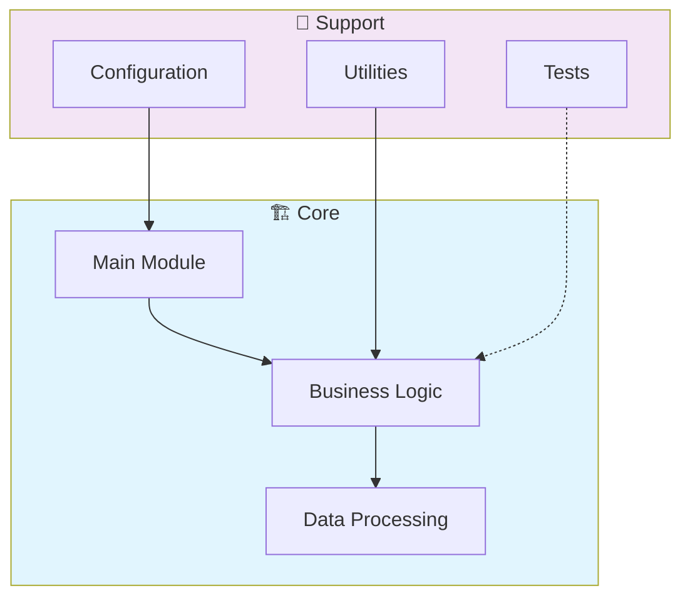
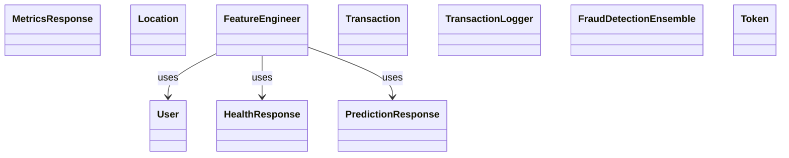

# 🤖 Ai Financial Fraud Detection

> AI-powered fraud detection system for financial transactions. Uses ensemble models, anomaly detection, and real-time scoring to identify fraudulent patterns.

[](https://img.shields.io/badge/)
[](LICENSE)

[English](#english) | [Português](#português)

---

## English

### 🎯 Overview

**Ai Financial Fraud Detection** is a production-grade Python application complemented by HTML that showcases modern software engineering practices including clean architecture, comprehensive testing, containerized deployment, and CI/CD readiness.

The codebase comprises **4,681 lines** of source code organized across **31 modules**, following industry best practices for maintainability, scalability, and code quality.

### ✨ Key Features

- **🤖 ML Pipeline**: End-to-end machine learning workflow from data to deployment
- **🔬 Feature Engineering**: Automated feature extraction and transformation
- **📊 Model Evaluation**: Comprehensive metrics and cross-validation
- **🚀 Model Serving**: Production-ready prediction API
- **🔍 Anomaly Detection**: Multiple detection algorithms with ensemble methods
- **📊 Real-time Scoring**: Sub-second transaction evaluation
- **🎯 Adaptive Learning**: Models that improve over time with new data
- **📈 Alert System**: Configurable thresholds and notification pipelines

### 🏗️ Architecture





### 🚀 Quick Start

#### Prerequisites

- Python 3.12+
- pip (Python package manager)
- Docker and Docker Compose (optional)

#### Installation

```bash
# Clone the repository
git clone https://github.com/galafis/ai-financial-fraud-detection.git
cd ai-financial-fraud-detection

# Create and activate virtual environment
python -m venv venv
source venv/bin/activate  # On Windows: venv\Scripts\activate

# Install dependencies
pip install -r requirements.txt
```

#### Running

```bash
# Run the application
python src/api/main.py
```

### 🐳 Docker

```bash
# Start all services
docker-compose up -d

# View logs
docker-compose logs -f

# Stop all services
docker-compose down

# Rebuild after changes
docker-compose up -d --build
```

### 🧪 Testing

```bash
# Run all tests
pytest

# Run with coverage report
pytest --cov --cov-report=html

# Run specific test module
pytest tests/test_main.py -v

# Run with detailed output
pytest -v --tb=short
```

### 📁 Project Structure

```
ai-financial-fraud-detection/
├── config/        # Configuration
│   ├── docker-compose.yml
│   └── requirements.txt
├── docker/
│   ├── Dockerfile
│   └── README.md
├── docs/          # Documentation
│   ├── images/
│   └── architecture_diagram.md
├── k8s/
│   ├── README.md
│   ├── deployment.yaml
│   └── service.yaml
├── notebooks/
│   └── README.md
├── src/          # Source code
│   ├── api/           # API endpoints
│   │   ├── README.md
│   │   ├── __init__.py
│   │   └── main.py
│   ├── config/        # Configuration
│   │   ├── README.md
│   │   ├── __init__.py
│   │   ├── api_config.py
│   │   └── model_config.py
│   ├── data/
│   │   ├── connectors/
│   │   ├── streaming/
│   │   ├── README.md
│   │   ├── __init__.py
│   │   ├── data_loader.py
│   │   └── feature_engineering.py
│   ├── features/
│   │   ├── README.md
│   │   └── __init__.py
│   ├── inference/
│   │   ├── README.md
│   │   └── __init__.py
│   ├── models/        # Data models
│   │   ├── ensemble/
│   │   ├── supervised/
│   │   ├── training/
│   │   ├── unsupervised/
│   │   ├── README.md
│   │   ├── __init__.py
│   │   └── ensemble_model.py
│   ├── monitoring/
│   │   ├── README.md
│   │   ├── __init__.py
│   │   └── model_monitoring.py
│   ├── utils/         # Utilities
│   │   ├── README.md
│   │   ├── __init__.py
│   │   └── logger.py
│   ├── README.md
│   ├── __init__.py
│   └── backtest.py
├── tests/         # Test suite
│   ├── integration/
│   │   ├── test_api.py
│   │   └── test_data_streaming.py
│   ├── performance/
│   │   ├── README.md
│   │   └── test_latency.py
│   ├── unit/
│   │   ├── test_ensemble_model.py
│   │   └── test_features.py
│   └── README.md
├── CONTRIBUTING.md
├── LICENSE
└── README.md
```

### 🔒 Security Considerations

| Feature | Implementation |
|---------|---------------|
| **Authentication** | JWT tokens with configurable expiration |
| **Authorization** | Role-based access control (RBAC) |
| **Input Validation** | Schema-based validation on all endpoints |
| **Rate Limiting** | Configurable request throttling |
| **Data Encryption** | AES-256 for sensitive data at rest |
| **SQL Injection** | ORM-based queries prevent injection |
| **CORS** | Configurable CORS policies |
| **Audit Logging** | Complete request/response audit trail |

> ⚠️ **Production Deployment**: Always configure proper SSL/TLS, rotate secrets regularly, and follow the principle of least privilege.

### 🛠️ Tech Stack

| Technology | Description | Role |
|------------|-------------|------|
| **Python** | Core Language | Primary |
| HTML | 1 files | Supporting |

### 🚀 Deployment

#### Cloud Deployment Options

The application is containerized and ready for deployment on:

| Platform | Service | Notes |
|----------|---------|-------|
| **AWS** | ECS, EKS, EC2 | Full container support |
| **Google Cloud** | Cloud Run, GKE | Serverless option available |
| **Azure** | Container Instances, AKS | Enterprise integration |
| **DigitalOcean** | App Platform, Droplets | Cost-effective option |

```bash
# Production build
docker build -t ai-financial-fraud-detection:latest .

# Tag for registry
docker tag ai-financial-fraud-detection:latest registry.example.com/ai-financial-fraud-detection:latest

# Push to registry
docker push registry.example.com/ai-financial-fraud-detection:latest
```

### 🤝 Contributing

Contributions are welcome! Please feel free to submit a Pull Request. For major changes, please open an issue first to discuss what you would like to change.

1. Fork the project
2. Create your feature branch (`git checkout -b feature/AmazingFeature`)
3. Commit your changes (`git commit -m 'Add some AmazingFeature'`)
4. Push to the branch (`git push origin feature/AmazingFeature`)
5. Open a Pull Request

### 📄 License

This project is licensed under the MIT License - see the [LICENSE](LICENSE) file for details.

### 👤 Author

**Gabriel Demetrios Lafis**
- GitHub: [@galafis](https://github.com/galafis)
- LinkedIn: [Gabriel Demetrios Lafis](https://linkedin.com/in/gabriel-demetrios-lafis)

---

## Português

### 🎯 Visão Geral

**Ai Financial Fraud Detection** é uma aplicação Python de nível profissional, complementada por HTML que demonstra práticas modernas de engenharia de software, incluindo arquitetura limpa, testes abrangentes, implantação containerizada e prontidão para CI/CD.

A base de código compreende **4,681 linhas** de código-fonte organizadas em **31 módulos**, seguindo as melhores práticas do setor para manutenibilidade, escalabilidade e qualidade de código.

### ✨ Funcionalidades Principais

- **🤖 ML Pipeline**: End-to-end machine learning workflow from data to deployment
- **🔬 Feature Engineering**: Automated feature extraction and transformation
- **📊 Model Evaluation**: Comprehensive metrics and cross-validation
- **🚀 Model Serving**: Production-ready prediction API
- **🔍 Anomaly Detection**: Multiple detection algorithms with ensemble methods
- **📊 Real-time Scoring**: Sub-second transaction evaluation
- **🎯 Adaptive Learning**: Models that improve over time with new data
- **📈 Alert System**: Configurable thresholds and notification pipelines

### 🏗️ Arquitetura


### 🚀 Início Rápido

#### Prerequisites

- Python 3.12+
- pip (Python package manager)
- Docker and Docker Compose (optional)

#### Installation

```bash
# Clone the repository
git clone https://github.com/galafis/ai-financial-fraud-detection.git
cd ai-financial-fraud-detection

# Create and activate virtual environment
python -m venv venv
source venv/bin/activate  # On Windows: venv\Scripts\activate

# Install dependencies
pip install -r requirements.txt
```

#### Running

```bash
# Run the application
python src/api/main.py
```

### 🐳 Docker

```bash
# Start all services
docker-compose up -d

# View logs
docker-compose logs -f

# Stop all services
docker-compose down

# Rebuild after changes
docker-compose up -d --build
```

### 🧪 Testing

```bash
# Run all tests
pytest

# Run with coverage report
pytest --cov --cov-report=html

# Run specific test module
pytest tests/test_main.py -v

# Run with detailed output
pytest -v --tb=short
```

### 📁 Estrutura do Projeto

```
ai-financial-fraud-detection/
├── config/        # Configuration
│   ├── docker-compose.yml
│   └── requirements.txt
├── docker/
│   ├── Dockerfile
│   └── README.md
├── docs/          # Documentation
│   ├── images/
│   └── architecture_diagram.md
├── k8s/
│   ├── README.md
│   ├── deployment.yaml
│   └── service.yaml
├── notebooks/
│   └── README.md
├── src/          # Source code
│   ├── api/           # API endpoints
│   │   ├── README.md
│   │   ├── __init__.py
│   │   └── main.py
│   ├── config/        # Configuration
│   │   ├── README.md
│   │   ├── __init__.py
│   │   ├── api_config.py
│   │   └── model_config.py
│   ├── data/
│   │   ├── connectors/
│   │   ├── streaming/
│   │   ├── README.md
│   │   ├── __init__.py
│   │   ├── data_loader.py
│   │   └── feature_engineering.py
│   ├── features/
│   │   ├── README.md
│   │   └── __init__.py
│   ├── inference/
│   │   ├── README.md
│   │   └── __init__.py
│   ├── models/        # Data models
│   │   ├── ensemble/
│   │   ├── supervised/
│   │   ├── training/
│   │   ├── unsupervised/
│   │   ├── README.md
│   │   ├── __init__.py
│   │   └── ensemble_model.py
│   ├── monitoring/
│   │   ├── README.md
│   │   ├── __init__.py
│   │   └── model_monitoring.py
│   ├── utils/         # Utilities
│   │   ├── README.md
│   │   ├── __init__.py
│   │   └── logger.py
│   ├── README.md
│   ├── __init__.py
│   └── backtest.py
├── tests/         # Test suite
│   ├── integration/
│   │   ├── test_api.py
│   │   └── test_data_streaming.py
│   ├── performance/
│   │   ├── README.md
│   │   └── test_latency.py
│   ├── unit/
│   │   ├── test_ensemble_model.py
│   │   └── test_features.py
│   └── README.md
├── CONTRIBUTING.md
├── LICENSE
└── README.md
```

### 🔒 Security Considerations

| Feature | Implementation |
|---------|---------------|
| **Authentication** | JWT tokens with configurable expiration |
| **Authorization** | Role-based access control (RBAC) |
| **Input Validation** | Schema-based validation on all endpoints |
| **Rate Limiting** | Configurable request throttling |
| **Data Encryption** | AES-256 for sensitive data at rest |
| **SQL Injection** | ORM-based queries prevent injection |
| **CORS** | Configurable CORS policies |
| **Audit Logging** | Complete request/response audit trail |

> ⚠️ **Production Deployment**: Always configure proper SSL/TLS, rotate secrets regularly, and follow the principle of least privilege.

### 🛠️ Stack Tecnológica

| Tecnologia | Descrição | Papel |
|------------|-----------|-------|
| **Python** | Core Language | Primary |
| HTML | 1 files | Supporting |

### 🚀 Deployment

#### Cloud Deployment Options

The application is containerized and ready for deployment on:

| Platform | Service | Notes |
|----------|---------|-------|
| **AWS** | ECS, EKS, EC2 | Full container support |
| **Google Cloud** | Cloud Run, GKE | Serverless option available |
| **Azure** | Container Instances, AKS | Enterprise integration |
| **DigitalOcean** | App Platform, Droplets | Cost-effective option |

```bash
# Production build
docker build -t ai-financial-fraud-detection:latest .

# Tag for registry
docker tag ai-financial-fraud-detection:latest registry.example.com/ai-financial-fraud-detection:latest

# Push to registry
docker push registry.example.com/ai-financial-fraud-detection:latest
```

### 🤝 Contribuindo

Contribuições são bem-vindas! Sinta-se à vontade para enviar um Pull Request.

### 📄 Licença

Este projeto está licenciado sob a Licença MIT - veja o arquivo [LICENSE](LICENSE) para detalhes.

### 👤 Autor

**Gabriel Demetrios Lafis**
- GitHub: [@galafis](https://github.com/galafis)
- LinkedIn: [Gabriel Demetrios Lafis](https://linkedin.com/in/gabriel-demetrios-lafis)
