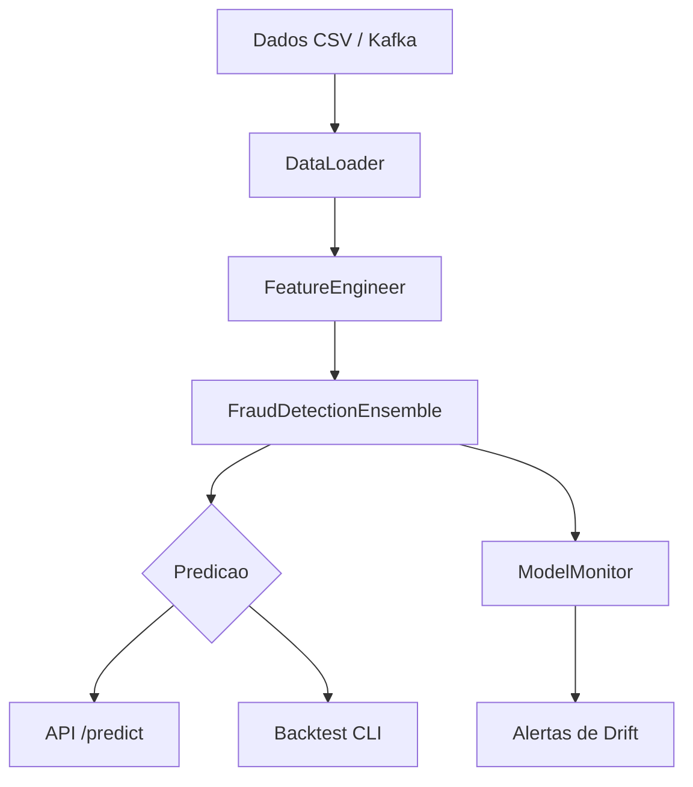

# AI Financial Fraud Detection

<div align="center">


</div>


Sistema de deteccao de fraudes financeiras usando modelos de machine learning em ensemble (Random Forest, XGBoost, rede neural e autoencoder).

[Portugues](#portugues) | [English](#english)

---

## Portugues

### Sobre

Este projeto implementa um sistema de deteccao de fraudes em transacoes financeiras. O nucleo e um modelo ensemble que combina quatro algoritmos de machine learning, com um meta-modelo (regressao logistica) para combinar as predicoes.

O projeto inclui:

- **Modelo ensemble** com Random Forest, XGBoost, rede neural (Keras) e autoencoder para deteccao de anomalias
- **API REST** com FastAPI para servir predicoes em tempo real (com autenticacao JWT)
- **Feature engineering** com agregacoes temporais por janela deslizante (1, 3, 7, 14, 30 dias)
- **Monitoramento de modelo** com deteccao de drift e alertas de degradacao
- **Consumer Kafka** para ingestao de transacoes em streaming
- **Script de backtest** para avaliacao historica do modelo

### Tecnologias

| Tecnologia | Uso |
|------------|-----|
| Python 3.9+ | Linguagem principal |
| scikit-learn, XGBoost | Modelos supervisionados |
| TensorFlow/Keras | Rede neural e autoencoder |
| SHAP, LIME | Explicabilidade de predicoes |
| FastAPI | API REST |
| kafka-python | Consumer de streaming |
| Prometheus | Metricas da API |
| Docker | Containerizacao |

### Arquitetura



### Estrutura do Projeto

```
ai-financial-fraud-detection/
├── config/
│   ├── docker-compose.yml
│   ├── requirements.txt
│   └── requirements-dev.txt
├── docker/
│   └── Dockerfile
├── k8s/
│   ├── deployment.yaml
│   └── service.yaml
├── src/
│   ├── api/
│   │   └── main.py              # API FastAPI (auth, predict, health, metrics)
│   ├── config/
│   │   ├── api_config.py        # Configuracoes da API
│   │   └── model_config.py      # Hiperparametros dos modelos
│   ├── data/
│   │   ├── data_loader.py       # Carga de dados (CSV, SQL, Kafka)
│   │   ├── feature_engineering.py # Feature engineering com janelas temporais
│   │   └── streaming/
│   │       └── kafka_consumer.py # Consumer Kafka
│   ├── models/
│   │   └── ensemble_model.py    # Modelo ensemble (RF + XGB + NN + AE + meta)
│   ├── monitoring/
│   │   └── model_monitoring.py  # Monitoramento de drift e performance
│   ├── utils/
│   │   └── logger.py            # Logging configuravel
│   └── backtest.py              # Script de backtesting
├── tests/
│   ├── unit/
│   │   ├── test_features.py
│   │   └── test_ensemble_model.py
│   ├── integration/
│   │   ├── test_api.py
│   │   └── test_data_streaming.py
│   └── performance/
│       └── test_latency.py
├── CONTRIBUTING.md
├── LICENSE
└── README.md
```

### Inicio Rapido

```bash
# Clonar o repositorio
git clone https://github.com/galafis/ai-financial-fraud-detection.git
cd ai-financial-fraud-detection

# Criar e ativar ambiente virtual
python -m venv venv
source venv/bin/activate  # Windows: venv\Scripts\activate

# Instalar dependencias
pip install -r config/requirements.txt

# Para desenvolvimento (inclui pytest, httpx)
pip install -r config/requirements-dev.txt
```

### Execucao

```bash
# Iniciar a API (requer modelo treinado em models/ensemble/)
uvicorn src.api.main:app --host 0.0.0.0 --port 8000

# Backtest em dados historicos
python -m src.backtest --start-date 2024-01-01 --end-date 2024-12-31 \
    --data-path data/transactions.csv --model-path models/ensemble
```

### Docker

```bash
# A partir da raiz do repositorio
docker compose -f config/docker-compose.yml up --build
```

### Testes

```bash
# Testes unitarios e de integracao
pytest tests/ -v

# Com cobertura
pytest tests/ --cov=src --cov-report=html
```

### Notas Importantes

- **Autenticacao**: A API usa usuarios demo com senhas em texto plano (admin/admin_password). Substituir por bcrypt + banco de dados real em producao.
- **Modelo**: Nenhum modelo pre-treinado e incluso no repositorio. O ensemble deve ser treinado antes de servir predicoes via API.
- **Kafka**: O consumer Kafka requer um broker Kafka em execucao. O docker-compose nao inclui Kafka por padrao.

### Autor

**Gabriel Demetrios Lafis**
- GitHub: [@galafis](https://github.com/galafis)
- LinkedIn: [Gabriel Demetrios Lafis](https://linkedin.com/in/gabriel-demetrios-lafis)

### Licenca

MIT License - veja [LICENSE](LICENSE) para detalhes.

---

## English

### About

This project implements a financial transaction fraud detection system. The core is an ensemble model combining four machine learning algorithms, with a meta-model (logistic regression) to combine predictions.

The project includes:

- **Ensemble model** with Random Forest, XGBoost, neural network (Keras), and autoencoder for anomaly detection
- **REST API** with FastAPI for serving real-time predictions (with JWT authentication)
- **Feature engineering** with sliding-window temporal aggregations (1, 3, 7, 14, 30 days)
- **Model monitoring** with drift detection and degradation alerts
- **Kafka consumer** for streaming transaction ingestion
- **Backtest script** for historical model evaluation

### Technologies

| Technology | Usage |
|------------|-------|
| Python 3.9+ | Primary language |
| scikit-learn, XGBoost | Supervised models |
| TensorFlow/Keras | Neural network and autoencoder |
| SHAP, LIME | Prediction explainability |
| FastAPI | REST API |
| kafka-python | Streaming consumer |
| Prometheus | API metrics |
| Docker | Containerization |

### Architecture


### Project Structure

```
ai-financial-fraud-detection/
├── config/
│   ├── docker-compose.yml
│   ├── requirements.txt
│   └── requirements-dev.txt
├── docker/
│   └── Dockerfile
├── k8s/
│   ├── deployment.yaml
│   └── service.yaml
├── src/
│   ├── api/
│   │   └── main.py              # FastAPI app (auth, predict, health, metrics)
│   ├── config/
│   │   ├── api_config.py        # API configuration
│   │   └── model_config.py      # Model hyperparameters
│   ├── data/
│   │   ├── data_loader.py       # Data loading (CSV, SQL, Kafka)
│   │   ├── feature_engineering.py # Feature engineering with time windows
│   │   └── streaming/
│   │       └── kafka_consumer.py # Kafka consumer
│   ├── models/
│   │   └── ensemble_model.py    # Ensemble model (RF + XGB + NN + AE + meta)
│   ├── monitoring/
│   │   └── model_monitoring.py  # Drift monitoring and performance tracking
│   ├── utils/
│   │   └── logger.py            # Configurable logging
│   └── backtest.py              # Backtesting script
├── tests/
│   ├── unit/
│   │   ├── test_features.py
│   │   └── test_ensemble_model.py
│   ├── integration/
│   │   ├── test_api.py
│   │   └── test_data_streaming.py
│   └── performance/
│       └── test_latency.py
├── CONTRIBUTING.md
├── LICENSE
└── README.md
```

### Quick Start

```bash
# Clone the repository
git clone https://github.com/galafis/ai-financial-fraud-detection.git
cd ai-financial-fraud-detection

# Create and activate virtual environment
python -m venv venv
source venv/bin/activate  # Windows: venv\Scripts\activate

# Install dependencies
pip install -r config/requirements.txt

# For development (includes pytest, httpx)
pip install -r config/requirements-dev.txt
```

### Running

```bash
# Start the API (requires a trained model in models/ensemble/)
uvicorn src.api.main:app --host 0.0.0.0 --port 8000

# Backtest on historical data
python -m src.backtest --start-date 2024-01-01 --end-date 2024-12-31 \
    --data-path data/transactions.csv --model-path models/ensemble
```

### Docker

```bash
# From the repository root
docker compose -f config/docker-compose.yml up --build
```

### Tests

```bash
# Unit and integration tests
pytest tests/ -v

# With coverage
pytest tests/ --cov=src --cov-report=html
```

### Important Notes

- **Authentication**: The API uses demo users with plaintext passwords (admin/admin_password). Replace with bcrypt + a real user store in production.
- **Model**: No pre-trained model is included in the repository. The ensemble must be trained before serving predictions via the API.
- **Kafka**: The Kafka consumer requires a running Kafka broker. The docker-compose does not include Kafka by default.

### Author

**Gabriel Demetrios Lafis**
- GitHub: [@galafis](https://github.com/galafis)
- LinkedIn: [Gabriel Demetrios Lafis](https://linkedin.com/in/gabriel-demetrios-lafis)

### License

MIT License - see [LICENSE](LICENSE) for details.
