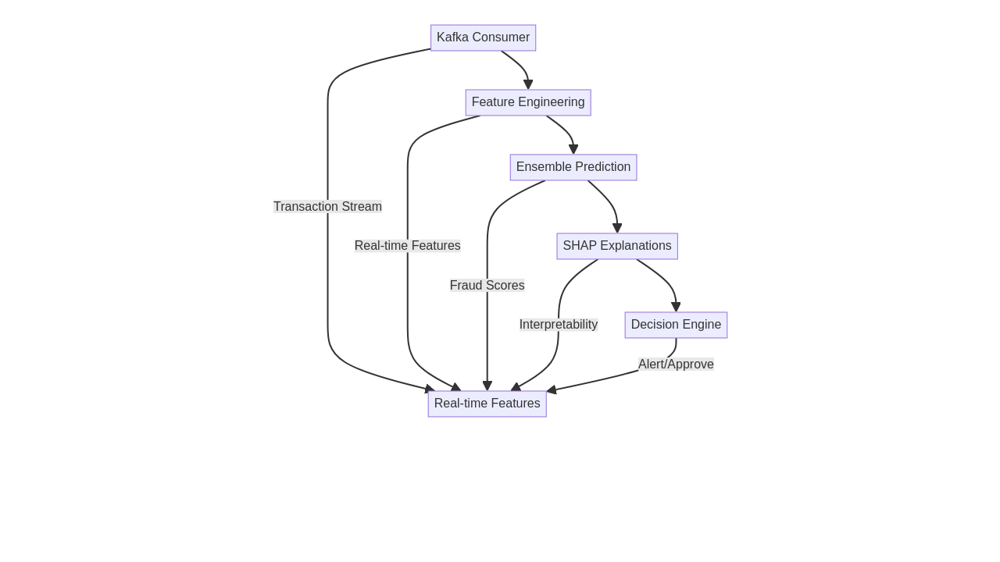

<<<<<<< HEAD
# AI Financial Fraud Detection

[](LICENSE)
[](https://www.python.org/)

Real-time fraud detection system built with FastAPI and scikit-learn, using ensemble ML methods (Random Forest, XGBoost, neural networks, Isolation Forest) to score financial transactions. Includes Kafka-based streaming, Prometheus metrics, and Docker/Kubernetes deployment configs.

## Quick Start

### API Usage

```bash
# Start the services
docker-compose -f config/docker-compose.yml up -d

# Get an auth token (demo credentials)
TOKEN=$(curl -s -X POST "http://localhost:8000/api/v1/auth/token" \
  -d "username=admin&password=admin_password" | jq -r .access_token)

# Score a transaction
curl -X POST "http://localhost:8000/api/v1/predict" \
  -H "Authorization: Bearer $TOKEN" \
  -H "Content-Type: application/json" \
  -d '{
    "transaction_id": "txn_12345",
    "amount": 1500.00,
    "merchant_id": "merchant_001",
    "customer_id": "cust_789",
    "timestamp": "2024-01-15T10:30:00Z",
    "payment_method": "credit_card"
  }'
```

**Python example:**
```python
import requests

# Authenticate
token_resp = requests.post(
    "http://localhost:8000/api/v1/auth/token",
    data={"username": "admin", "password": "admin_password"}
)
token = token_resp.json()["access_token"]

# Score a transaction
response = requests.post(
    "http://localhost:8000/api/v1/predict",
    headers={"Authorization": f"Bearer {token}"},
    json={
        "transaction_id": "txn_12345",
        "amount": 1500.00,
        "merchant_id": "merchant_001",
        "customer_id": "cust_789",
        "timestamp": "2024-01-15T10:30:00Z",
        "payment_method": "credit_card"
    }
=======
# AI Financial Fraud Detection System
<!-- Imagem Hero -->

<!-- Badges -->
[](LICENSE)
[](https://www.python.org/)
[](../../stargazers)
> **⭐ If this project helps you, please give it a star and share it with your network! Your support helps the community grow.**
Advanced real-time fraud detection system using Machine Learning, Deep Learning, and streaming architecture with comprehensive monitoring and MLOps practices.
## 🚀 Quick Demo
### API Usage Example
```bash
# Start the system
docker-compose up -d
# Test fraud detection endpoint
curl -X POST "http://localhost:8000/predict" \
-H "Content-Type: application/json" \
-d \
{
"transaction_id": "txn_12345",
"amount": 1500.00,
"merchant_category": "electronics",
"user_id": "user_789",
"timestamp": "2024-01-15T10:30:00Z"
}
```
**Python Example:**
```python
import requests
# Fraud detection request
response = requests.post(
"http://localhost:8000/predict",
json={
"transaction_id": "txn_12345",
"amount": 1500.00,
"merchant_category": "electronics",
"user_id": "user_789",
"timestamp": "2024-01-15T10:30:00Z"
}
>>>>>>> b76d5861d5428d292b102ab8725d0c7a3dc39069
)
result = response.json()
print(f"Fraud probability: {result['fraud_probability']}")
print(f"Is fraud: {result['is_fraud']}")
print(f"Risk level: {result['risk_level']}")
```
<<<<<<< HEAD

**Sample response:**
```json
{
  "transaction_id": "txn_12345",
  "fraud_probability": 0.23,
  "is_fraud": false,
  "risk_level": "low",
  "explanation": null,
  "processing_time_ms": 45.2
}
```

## Models

- **Supervised**: Random Forest, XGBoost, feedforward neural network
- **Unsupervised**: Isolation Forest, autoencoder-based anomaly detection
- **Ensemble**: weighted combination with a stacking meta-learner
- **Explainability**: SHAP values (when available) for per-prediction feature attribution

## Project Structure

```
src/
├── api/            # FastAPI app (main.py)
├── config/         # Centralised settings (api_config.py, model_config.py)
├── data/           # Data loading, feature engineering, Kafka streaming
├── models/         # Ensemble model, supervised/unsupervised sub-modules
├── monitoring/     # Model monitoring utilities
└── utils/          # Logger and shared helpers
config/
├── docker-compose.yml
└── requirements.txt
docker/
└── Dockerfile
k8s/
├── deployment.yaml
└── service.yaml
tests/
├── unit/
├── integration/
└── performance/
```

## Setup

**Prerequisites:** Python 3.9+, Docker (optional), Kafka (optional, for streaming).

=======
**Expected Response:**
```json
{
"transaction_id": "txn_12345",
"fraud_score": 0.23,
"decision": "approve",
"confidence": 0.89,
"shap_explanation": {
"top_features": [
{"feature": "amount_zscore", "impact": -0.15},
{"feature": "merchant_risk", "impact": 0.08}
]
},
"processing_time_ms": 45
}
```
### Running the Backtest
To run a historical backtest of the fraud detection system, use the `backtest.py` script:
```bash
python src/backtest.py --start-date YYYY-MM-DD --end-date YYYY-MM-DD --data-path path/to/your/transactions.csv --model-path path/to/your/model_directory
```
Example:
>>>>>>> b76d5861d5428d292b102ab8725d0c7a3dc39069
```bash
# Install dependencies
pip install -r config/requirements.txt

# Run the API locally
uvicorn src.api.main:app --reload

# Or use Docker
docker-compose -f config/docker-compose.yml up --build
```
<<<<<<< HEAD

## Configuration

Settings are managed through environment variables with sensible defaults in `src/config/api_config.py` and `src/config/model_config.py`.

Key environment variables:

| Variable | Default | Description |
|---|---|---|
| `SECRET_KEY` | `change-me-in-production` | JWT signing key |
| `MODEL_PATH` | `models/ensemble` | Path to saved model artifacts |
| `KAFKA_ENABLED` | `false` | Enable Kafka streaming |
| `REDIS_ENABLED` | `false` | Enable Redis caching |
| `LOG_LEVEL` | `INFO` | Logging verbosity |

## Monitoring

The API exposes Prometheus-compatible metrics at `/api/v1/metrics` (requires auth) covering prediction counts, latency histograms, and model confidence. A health check endpoint is available at `/api/v1/health` (no auth required).

## Testing

=======
## 🤖 Implemented Models
- **Supervised Learning**: RandomForest, XGBoost, Neural Networks
- **Unsupervised Learning**: Isolation Forest, Autoencoders, Clustering
- **Ensemble Methods**: Voting, Stacking, Dynamic weighting
- **Explainability**: SHAP values for model interpretability
## 🏗️ Real-time Streaming Architecture

## 📊 Monitoring & MLOps
### Key Metrics
- **Model Performance**: Precision, Recall, F1-Score, AUC-ROC
- **System Performance**: Latency, Throughput, Error rates
- **Data Quality**: Drift detection, Feature distribution monitoring
### Automated Alerts
- Performance degradation detection
- Latency spike notifications
- Data drift warnings
- Pipeline failure alerts
## ⚙️ Configuration
- **Model Configuration**: `config/model_config.py`
- **Decision Thresholds**: `config/thresholds.py`
- **Environment Settings**: `.env.example`
## 🧪 Testing
>>>>>>> b76d5861d5428d292b102ab8725d0c7a3dc39069
```bash
# Run tests that don't require external services
pytest tests/unit/
<<<<<<< HEAD

# Integration tests (need a running API)
pytest tests/integration/

# Performance benchmarks
pytest tests/performance/ -m performance
```

## Contributing

See [CONTRIBUTING.md](CONTRIBUTING.md) for guidelines. In short: fork, branch, add tests, open a PR.

## License

MIT — see [LICENSE](LICENSE).

---

# Sistema de Detecção de Fraudes Financeiras com IA

[](LICENSE)
[](https://www.python.org/)

Sistema de detecção de fraudes em tempo real construído com FastAPI e scikit-learn, usando métodos de ensemble (Random Forest, XGBoost, redes neurais, Isolation Forest) para pontuar transações financeiras. Inclui streaming via Kafka, métricas Prometheus e configurações de deploy com Docker/Kubernetes.

## Início Rápido

```bash
# Iniciar os serviços
docker-compose -f config/docker-compose.yml up -d

# Obter token de autenticação (credenciais de demonstração)
TOKEN=$(curl -s -X POST "http://localhost:8000/api/v1/auth/token" \
  -d "username=admin&password=admin_password" | jq -r .access_token)

# Analisar uma transação
curl -X POST "http://localhost:8000/api/v1/predict" \
  -H "Authorization: Bearer $TOKEN" \
  -H "Content-Type: application/json" \
  -d '{
    "transaction_id": "txn_12345",
    "amount": 1500.00,
    "merchant_id": "merchant_001",
    "customer_id": "cust_789",
    "timestamp": "2024-01-15T10:30:00Z",
    "payment_method": "credit_card"
  }'
```

## Modelos

- **Supervisionados**: Random Forest, XGBoost, rede neural feedforward
- **Não supervisionados**: Isolation Forest, detecção de anomalias com autoencoder
- **Ensemble**: combinação ponderada com meta-aprendiz por stacking
- **Explicabilidade**: valores SHAP para atribuição de features por predição

## Configuração

Variáveis de ambiente controlam o comportamento do sistema. Veja `src/config/api_config.py` e `src/config/model_config.py` para valores padrão.

## Testes

```bash
pytest tests/unit/
pytest tests/integration/
pytest tests/performance/ -m performance
```

## Como Contribuir

Veja [CONTRIBUTING.md](CONTRIBUTING.md). Em resumo: fork, branch, adicione testes, abra um PR.

## Licença

MIT — veja [LICENSE](LICENSE).
=======
# Integration tests
pytest tests/integration/
# Performance tests
pytest tests/performance/
# Full test suite with coverage
pytest --cov=src tests/
```
## 🤝 How to Contribute
We welcome contributions from the community! Here's how to get started:
### Quick Start for Contributors
1. **Fork the Repository**
```bash
# Click the 'Fork' button at the top of this page
```
2. **Clone Your Fork**
```bash
git clone https://github.com/YOUR_USERNAME/ai-financial-fraud-detection.git
cd ai-financial-fraud-detection
```
3. **Create a Feature Branch**
```bash
git checkout -b feature/your-awesome-feature
# or for bug fixes:
git checkout -b fix/issue-description
```
4. **Make Your Changes**
- Write clean, documented code
- Add tests for new features
- Update documentation as needed
5. **Test Your Changes**
```bash
pytest tests/
pre-commit run --all-files # Code formatting & linting
```
6. **Commit Your Changes**
```bash
git add .
git commit -m "feat: add awesome new feature"
# Use conventional commits: feat:, fix:, docs:, test:, refactor:
```
7. **Push and Create Pull Request**
```bash
git push origin feature/your-awesome-feature
# Then open a Pull Request on GitHub
```
### What We're Looking For
- 🐛 Bug fixes
- ✨ New ML models or features
- 📚 Documentation improvements
- 🧪 Additional tests
- 🔧 Performance optimizations
- 📊 New monitoring capabilities
### Code Style
- Follow PEP 8 guidelines
- Use type hints
- Write docstrings for functions
- Add unit tests for new code
---
## 📄 License
MIT License. See [LICENSE](LICENSE) for details.
---
# 🇧🇷 Sistema de Detecção de Fraudes Financeiras com IA
<!-- Badges em Português -->
[](https://codecov.io/gh/galafis/ai-financial-fraud-detection)
[](LICENSE)
[](https://www.python.org/)
[](../../stargazers)
[](../../network/members)
[](../../watchers)
[](../../issues)
[](../../graphs/contributors)
> **⭐ Se este projeto te ajudou, deixe uma estrela e compartilhe! Seu apoio ajuda a comunidade a crescer.**
Sistema avançado de detecção de fraudes em tempo real usando Machine Learning, Deep Learning e arquitetura de streaming com práticas abrangentes de monitoramento e MLOps.
## 🚀 Demonstração Rápida
### Exemplo de Uso da API
```bash
# Iniciar o sistema
docker-compose up -d
# Testar endpoint de detecção de fraude
curl -X POST "http://localhost:8000/predict" \
-H "Content-Type: application/json" \
-d \
{
"transaction_id": "txn_12345",
"amount": 1500.00,
"merchant_category": "electronics",
"user_id": "user_789",
"timestamp": "2024-01-15T10:30:00Z"
}
```
### Executando o Backtest
Para executar um backtest histórico do sistema de detecção de fraudes, use o script `backtest.py`:
```bash
python src/backtest.py --start-date AAAA-MM-DD --end-date AAAA-MM-DD --data-path caminho/para/suas/transacoes.csv --model-path caminho/para/seu/diretorio_do_modelo
```
Exemplo:
```bash
python src/backtest.py --start-date 2023-01-01 --end-date 2023-01-31 --data-path data/processed/transactions.csv --model-path models/ensemble_model
```
## 🤖 Modelos Implementados
- **Aprendizado Supervisionado**: RandomForest, XGBoost, Redes Neurais
- **Aprendizado Não Supervisionado**: Isolation Forest, Autoencoders, Agrupamento
- **Métodos de Ensemble**: Votação, Empilhamento, Ponderação Dinâmica
- **Explicabilidade**: Valores SHAP para interpretabilidade do modelo
## 🏗️ Arquitetura de Streaming em Tempo Real

## 📊 Monitoramento e MLOps
### Métricas Chave
- **Desempenho do Modelo**: Precisão, Recall, F1-Score, AUC-ROC
- **Desempenho do Sistema**: Latência, Vazão, Taxas de Erro
- **Qualidade dos Dados**: Detecção de desvio, Monitoramento de distribuição de características
### Alertas Automatizados
- Detecção de degradação de desempenho
- Notificações de pico de latência
- Avisos de desvio de dados
- Alertas de falha de pipeline
## ⚙️ Configuração
- **Configuração do Modelo**: `config/model_config.py`
- **Limiares de Decisão**: `config/thresholds.py`
- **Configurações de Ambiente**: `.env.example`
## 🧪 Testes
```bash
# Testes de Unidade
pytest tests/unit/
# Testes de Integração
pytest tests/integration/
# Testes de Desempenho
pytest tests/performance/
# Suíte de Testes Completa com Cobertura
pytest --cov=src tests/
```
## 🤝 Como Contribuir
Aceitamos contribuições da comunidade! Veja como começar:
### Início Rápido para Contribuidores
1. **Faça um Fork do Repositório**
```bash
# Clique no botão 'Fork' no topo desta página
```
2. **Clone Seu Fork**
```bash
git clone https://github.com/YOUR_USERNAME/ai-financial-fraud-detection.git
cd ai-financial-fraud-detection
```
3. **Crie uma Branch de Funcionalidade**
```bash
git checkout -b feature/sua-nova-funcionalidade-incrivel
# ou para correções de bugs:
git checkout -b fix/descricao-do-problema
```
4. **Faça Suas Alterações**
- Escreva código limpo e documentado
- Adicione testes para novas funcionalidades
- Atualize a documentação conforme necessário
5. **Teste Suas Alterações**
```bash
pytest tests/
pre-commit run --all-files # Formatação e linting de código
```
6. **Commit Suas Alterações**
```bash
git add .
git commit -m "feat: adiciona nova funcionalidade incrível"
# Use commits convencionais: feat:, fix:, docs:, test:, refactor:
```
7. **Envie e Crie um Pull Request**
```bash
git push origin feature/sua-nova-funcionalidade-incrivel
# Em seguida, abra um Pull Request no GitHub
```
### O Que Estamos Procurando
- 🐛 Correções de bugs
- ✨ Novos modelos ou funcionalidades de ML
- 📚 Melhorias na documentação
- 🧪 Testes adicionais
- 🔧 Otimizações de desempenho
- 📊 Novas capacidades de monitoramento
### Estilo de Código
- Siga as diretrizes da PEP 8
- Use type hints
- Escreva docstrings para funções
- Adicione testes de unidade para novo código
---
## 📄 Licença
Licença MIT. Veja [LICENSE](LICENSE) para detalhes.
---
**✨ Juntos podemos construir uma solução ainda melhor para detecção de fraudes!**
>>>>>>> b76d5861d5428d292b102ab8725d0c7a3dc39069
