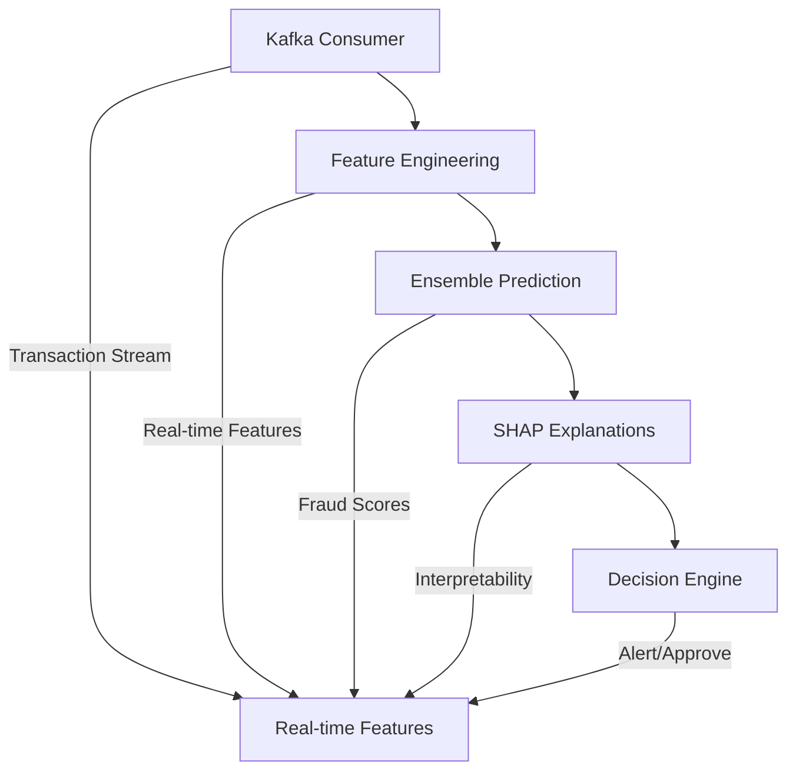

```mermaid
graph TD
    A[Kafka Consumer] --> B[Feature Engineering]
    B --> C[Ensemble Prediction]
    C --> D[SHAP Explanations]
    D --> E[Decision Engine]
    A -- Transaction Stream --> F[Real-time Features]
    B -- Real-time Features --> F
    C -- Fraud Scores --> F
    D -- Interpretability --> F
    E -- Alert/Approve --> F
```
