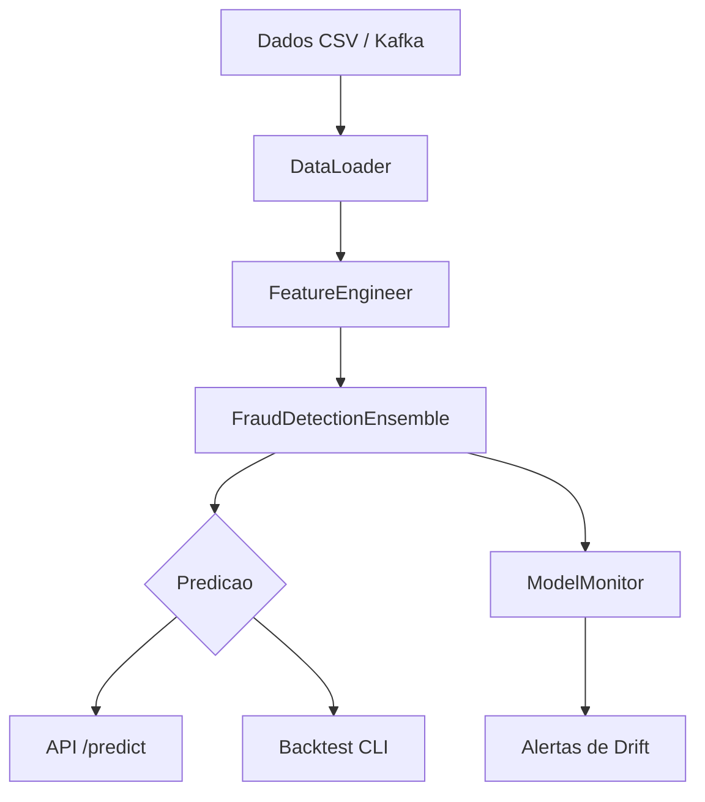

```mermaid
graph TD
    A[Dados CSV / Kafka] --> B[DataLoader]
    B --> C[FeatureEngineer]
    C --> D[FraudDetectionEnsemble]
    D --> E{Predicao}
    E --> F[API /predict]
    E --> G[Backtest CLI]
    D --> H[ModelMonitor]
    H --> I[Alertas de Drift]
```
